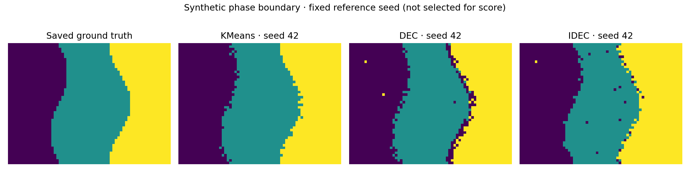
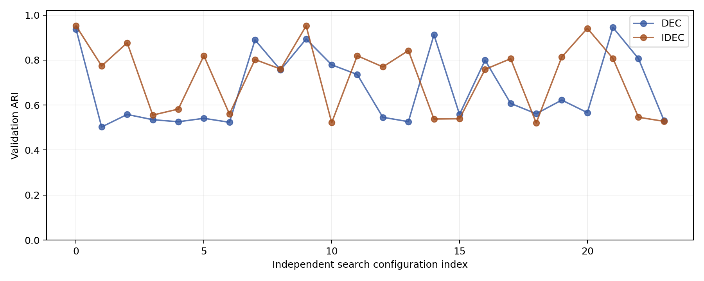

# DEC / IDEC phase-boundary experiment

Actual CPU PyTorch training on the saved synthetic spatial phase benchmark (48×64, 3,072 samples, six features). Research H5/DM3 data were not used. The test features and labels match the committed earlier K-means benchmark; its metrics were reproduced to numerical tolerance.

## Protocol

Separate searches: 24 configurations per model: 23 random draws and one default, independently sampled with seeds 101 (DEC) and 202 (IDEC). Each candidate uses training seed 7. Selection maximizes ARI on an unseen noise realization (validation data seed 1618), after fitting on data seed 2718. Labels are saved and never passed into gradient training. Empty clusters or a cluster below 1% of validation samples disqualify a candidate. Exact ties prefer smaller latent dimension. This is a bounded random search, not proof of a global optimum. The geometries and phase means are shared across maps, so validation tests noise generalization, not new boundary geometries.

Final selected configurations are frozen before five fresh runs (42–46) on the original benchmark (data seed 314). Final fitting is transductive, matching the original K-means protocol. Final labels are used only for reporting, not selection. Uncertainty is across training seeds on a fixed dataset, not across physical specimens. The aggregate file includes sample variance and two-sided Student-t 95% confidence intervals for the mean (not clipped to metric bounds).

Architecture: 6→32→16→latent and mirrored decoder; ReLU hidden layers, linear latent/output. Standardization is fitted on training observations. Full-batch Adam; 150 refinement epochs; sharpened frequency-normalized targets refreshed every five epochs; Student-t alpha=1. DEC minimizes weight×KL(P||Q); IDEC minimizes MSE+weight×KL(P||Q). K-means initializes centers only, followed by gradient fitting. For DEC, scaling its sole loss is largely redundant under Adam, so the weight is searched as requested but is not a reconstruction tradeoff.

Internal scores use full learned encoder embeddings, without PCA. K-means uses original features to reproduce the baseline; silhouette values across these different spaces are not an apples-to-apples ranking. Final assignments come directly from Student-t argmax. Every run saves its checkpoint, latent embeddings, probabilities, fitted centers, initial centers, loss history, and runtime code-path evidence.

## Final comparison (mean ± sample SD, n=5)

| Model | ARI ↑ | NMI ↑ | Boundary F1 ↑ | Boundary IoU ↑ | Boundary distance px ↓ |
|---|---:|---:|---:|---:|---:|
| KMeans | 0.96821 ± 0.00000 | 0.94433 ± 0.00000 | 0.98678 ± 0.00000 | 0.75833 ± 0.00000 | 0.14333 ± 0.00000 |
| DEC | 0.81917 ± 0.17579 | 0.81387 ± 0.13362 | 0.79887 ± 0.26635 | 0.41815 ± 0.19386 | 1.73952 ± 2.55512 |
| IDEC | 0.92854 ± 0.02401 | 0.90112 ± 0.02368 | 0.91565 ± 0.05036 | 0.52408 ± 0.13056 | 0.59953 ± 0.32478 |

Boundaries use two-sided four-neighbor edges. F1 uses a one-pixel Euclidean tolerance; IoU is exact; distance is the mean of both directed boundary-distance samples. Raw scores preserve every predicted cluster edge. Existing phase-matched boundary scores are also retained for baseline compatibility; these can hide oversegmentation when k exceeds the number of phases.

## Selection and degeneracy

**Preferred deep model by the predeclared validation objective: IDEC.** This judgment uses validation ARI, not the final test scores. Compare final robustness and boundary scores below before adopting it.

DEC: DEC_21, validation ARI 0.944908; config `{"latent_dim": 3, "n_clusters": 3, "clustering_weight": 0.01, "pretrain_epochs": 150, "learning_rate": 0.0003, "cluster_epochs": 150, "update_interval": 5}`.
Validation cluster counts: [992, 939, 1141]; minimum fraction 0.3057.
- Seed 42: occupied 3, sizes [941, 1069, 1062], degenerate=False; center movement 0.145521, encoder movement 0.738546.
- Seed 43: occupied 3, sizes [1096, 1057, 919], degenerate=False; center movement 0.146381, encoder movement 0.772528.
- Seed 44: occupied 3, sizes [925, 970, 1177], degenerate=False; center movement 0.137244, encoder movement 0.725082.
- Seed 45: occupied 3, sizes [923, 1112, 1037], degenerate=False; center movement 0.144944, encoder movement 0.685283.
- Seed 46: occupied 3, sizes [1708, 988, 376], degenerate=False; center movement 0.138933, encoder movement 0.677617.

IDEC: IDEC_09, validation ARI 0.951783; config `{"latent_dim": 3, "n_clusters": 3, "clustering_weight": 0.01, "pretrain_epochs": 150, "learning_rate": 0.001, "cluster_epochs": 150, "update_interval": 5}`.
Validation cluster counts: [957, 1140, 975]; minimum fraction 0.3115.
- Seed 42: occupied 3, sizes [997, 1040, 1035], degenerate=False; center movement 0.398955, encoder movement 1.81568.
- Seed 43: occupied 3, sizes [1084, 998, 990], degenerate=False; center movement 0.430012, encoder movement 2.01186.
- Seed 44: occupied 3, sizes [940, 960, 1172], degenerate=False; center movement 0.460375, encoder movement 1.71239.
- Seed 45: occupied 3, sizes [1015, 1112, 945], degenerate=False; center movement 0.417816, encoder movement 1.9599.
- Seed 46: occupied 3, sizes [1107, 969, 996], degenerate=False; center movement 0.39913, encoder movement 2.02663.

## Every search configuration

| Model / ID | Latent | k | KL weight | Pretrain epochs | LR | Validation ARI | Raw boundary F1 | Counts | Status / degenerate |
|---|---:|---:|---:|---:|---:|---:|---:|---|---|
| DEC_00 | 3 | 3 | 1.0 | 75 | 0.001 | 0.937275 | 0.945274 | [1111, 953, 1008] | ok / False |
| DEC_01 | 3 | 3 | 10.0 | 25 | 0.001 | 0.502556 | 0.330854 | [1958, 77, 1037] | ok / False |
| DEC_02 | 1 | 2 | 10.0 | 75 | 0.003 | 0.558240 | 0.843421 | [1877, 1195] | ok / False |
| DEC_03 | 3 | 2 | 0.1 | 150 | 0.0003 | 0.534880 | 0.652055 | [2111, 961] | ok / False |
| DEC_04 | 4 | 2 | 1.0 | 25 | 0.0003 | 0.525761 | 0.606708 | [1017, 2055] | ok / False |
| DEC_05 | 2 | 2 | 0.01 | 25 | 0.003 | 0.541012 | 0.698926 | [1781, 1291] | ok / False |
| DEC_06 | 4 | 3 | 10.0 | 25 | 0.0003 | 0.523360 | 0.533774 | [1009, 37, 2026] | ok / False |
| DEC_07 | 2 | 3 | 1.0 | 150 | 0.003 | 0.889440 | 0.819575 | [905, 1150, 1017] | ok / False |
| DEC_08 | 2 | 5 | 10.0 | 25 | 0.003 | 0.755754 | 0.433246 | [459, 1119, 904, 140, 450] | ok / False |
| DEC_09 | 1 | 3 | 1.0 | 150 | 0.003 | 0.893470 | 0.872160 | [1038, 982, 1052] | ok / False |
| DEC_10 | 1 | 4 | 0.01 | 75 | 0.003 | 0.778820 | 0.445538 | [758, 956, 974, 384] | ok / False |
| DEC_11 | 2 | 5 | 0.1 | 75 | 0.001 | 0.735763 | 0.428159 | [958, 707, 306, 898, 203] | ok / False |
| DEC_12 | 2 | 2 | 10.0 | 25 | 0.001 | 0.545615 | 0.755046 | [1790, 1282] | ok / False |
| DEC_13 | 4 | 2 | 1.0 | 75 | 0.0003 | 0.526254 | 0.611598 | [1016, 2056] | ok / False |
| DEC_14 | 2 | 4 | 0.01 | 150 | 0.001 | 0.912156 | 0.889600 | [1064, 897, 981, 130] | ok / False |
| DEC_15 | 1 | 2 | 0.01 | 75 | 0.003 | 0.558240 | 0.843421 | [1877, 1195] | ok / False |
| DEC_16 | 1 | 4 | 0.1 | 150 | 0.001 | 0.799274 | 0.575586 | [985, 887, 916, 284] | ok / False |
| DEC_17 | 2 | 3 | 0.1 | 150 | 0.0003 | 0.607242 | 0.387756 | [582, 1291, 1199] | ok / False |
| DEC_18 | 2 | 5 | 0.01 | 75 | 0.0003 | 0.561342 | 0.632959 | [76, 1119, 1715, 95, 67] | ok / False |
| DEC_19 | 3 | 4 | 0.01 | 25 | 0.0003 | 0.622153 | 0.351716 | [15, 1551, 981, 525] | ok / True |
| DEC_20 | 2 | 4 | 10.0 | 75 | 0.0003 | 0.566273 | 0.673684 | [98, 96, 1136, 1742] | ok / False |
| DEC_21 | 3 | 3 | 0.01 | 150 | 0.0003 | 0.944908 | 0.956447 | [992, 939, 1141] | ok / False |
| DEC_22 | 2 | 5 | 1.0 | 150 | 0.001 | 0.806328 | 0.504151 | [899, 287, 928, 828, 130] | ok / False |
| DEC_23 | 3 | 2 | 1.0 | 25 | 0.0003 | 0.530982 | 0.650584 | [2074, 998] | ok / False |
| IDEC_00 | 3 | 3 | 1.0 | 75 | 0.001 | 0.951656 | 0.965517 | [1124, 966, 982] | ok / False |
| IDEC_01 | 2 | 5 | 0.1 | 150 | 0.003 | 0.773766 | 0.437373 | [909, 881, 354, 146, 782] | ok / False |
| IDEC_02 | 3 | 4 | 10.0 | 25 | 0.003 | 0.876626 | 0.771757 | [1020, 885, 1026, 141] | ok / False |
| IDEC_03 | 2 | 3 | 10.0 | 25 | 0.0003 | 0.555370 | 0.589436 | [58, 1772, 1242] | ok / False |
| IDEC_04 | 1 | 3 | 0.1 | 75 | 0.0003 | 0.582044 | 0.326017 | [452, 1010, 1610] | ok / False |
| IDEC_05 | 2 | 3 | 0.01 | 25 | 0.001 | 0.819076 | 0.488334 | [1005, 1262, 805] | ok / False |
| IDEC_06 | 2 | 2 | 10.0 | 150 | 0.0003 | 0.559879 | 0.782063 | [1826, 1246] | ok / False |
| IDEC_07 | 1 | 4 | 10.0 | 150 | 0.001 | 0.802163 | 0.577959 | [979, 889, 919, 285] | ok / False |
| IDEC_08 | 2 | 5 | 1.0 | 25 | 0.003 | 0.759877 | 0.445404 | [453, 1017, 916, 191, 495] | ok / False |
| IDEC_09 | 3 | 3 | 0.01 | 150 | 0.001 | 0.951783 | 0.929254 | [957, 1140, 975] | ok / False |
| IDEC_10 | 4 | 2 | 1.0 | 75 | 0.0003 | 0.521844 | 0.560122 | [1025, 2047] | ok / False |
| IDEC_11 | 3 | 5 | 0.1 | 75 | 0.003 | 0.819121 | 0.551605 | [958, 861, 887, 221, 145] | ok / False |
| IDEC_12 | 2 | 5 | 0.1 | 25 | 0.003 | 0.769615 | 0.444739 | [736, 968, 928, 281, 159] | ok / False |
| IDEC_13 | 3 | 4 | 10.0 | 25 | 0.0003 | 0.842160 | 0.493462 | [30, 1054, 1084, 904] | ok / True |
| IDEC_14 | 4 | 5 | 1.0 | 75 | 0.0003 | 0.537857 | 0.329045 | [14, 997, 464, 29, 1568] | ok / True |
| IDEC_15 | 1 | 2 | 0.1 | 25 | 0.003 | 0.539108 | 0.629834 | [975, 2097] | ok / False |
| IDEC_16 | 4 | 5 | 10.0 | 150 | 0.003 | 0.758611 | 0.381481 | [508, 876, 957, 581, 150] | ok / False |
| IDEC_17 | 2 | 5 | 1.0 | 75 | 0.003 | 0.806004 | 0.410220 | [539, 1076, 966, 357, 134] | ok / False |
| IDEC_18 | 2 | 2 | 0.01 | 25 | 0.003 | 0.520454 | 0.503169 | [1030, 2042] | ok / False |
| IDEC_19 | 1 | 4 | 1.0 | 150 | 0.0003 | 0.813526 | 0.518987 | [775, 1111, 941, 245] | ok / False |
| IDEC_20 | 4 | 3 | 0.1 | 75 | 0.003 | 0.941054 | 0.957692 | [996, 1117, 959] | ok / False |
| IDEC_21 | 1 | 4 | 1.0 | 75 | 0.003 | 0.807240 | 0.484985 | [811, 951, 966, 344] | ok / False |
| IDEC_22 | 1 | 2 | 1.0 | 150 | 0.001 | 0.545768 | 0.928590 | [1945, 1127] | ok / False |
| IDEC_23 | 4 | 2 | 0.1 | 150 | 0.003 | 0.527583 | 0.614359 | [1010, 2062] | ok / False |

## Reproduce

`python run_deep_benchmark.py --output <new-directory> --trials 24` from Phase Boundary Testing. Install requirements-deep.txt. Existing output directories are rejected to prevent mixing experiments.

Definitions follow [DEC](https://proceedings.mlr.press/v48/xieb16.html) and [IDEC](https://www.ijcai.org/Proceedings/2017/243). This is a compact PyTorch implementation of their objectives, not a reproduction of their published large-network experiments.

## Verification and visual checks

16 unit/integration tests passed. 48 independent search configurations completed (24 per model). 10 final deep-model runs completed, separate from search; 5 K-means runs reproduced the earlier baseline. 58 deep-training logs checked: positive encoder and center movement, 150 clustering steps, no fallback. Saved final benchmark features and labels match the earlier committed dataset. All five requested hyperparameters vary in each independent search.

## Practical interpretation

DEC minus K-means: mean ARI -0.149046; mean raw boundary F1 -0.187911. IDEC minus K-means: mean ARI -0.039678; mean raw boundary F1 -0.071130. The highest validation ARI identifies the preferred deep configuration, but does not establish superiority to K-means or optimality on real research data. A single training seed per search configuration leaves selection uncertainty; the five final seeds quantify robustness only after selection.

IDEC retained three occupied clusters in all five final runs, with all cluster fractions between 30.6% and 38.2%. DEC seed 46 had sizes [1708, 988, 376] (55.6%, 32.2%, 12.2%), ARI 0.51056, and boundary F1 0.32696. It passes the narrow empty/tiny-cluster check but is a poor and imbalanced phase recovery; occupied count alone is insufficient. IDEC is the preferred deep model because its validation ARI is highest and its final seed variability is substantially lower. K-means remains the best measured method on this benchmark.
